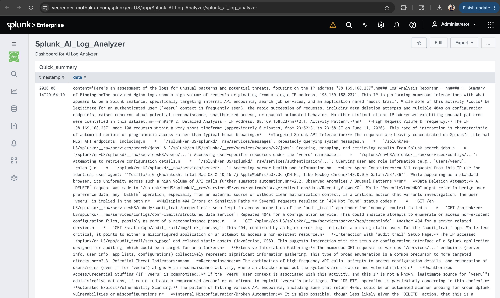
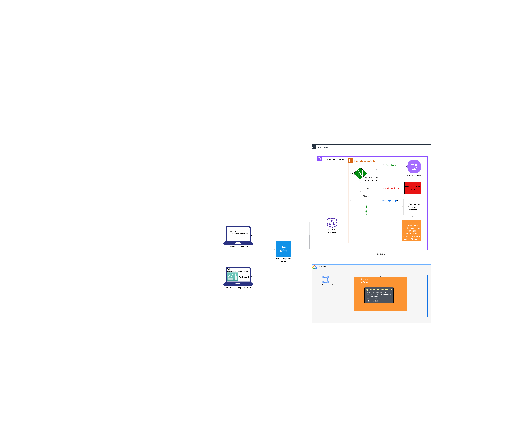

# Splunk-AI-Log-Analyzer
Splunk App for Logs Analyzing 


## Overview

The Splunk-AI-Log-Analyzer App analyzes logs from the Nginx web service running on an AWS EC2 instance. It filters out known/expected events and focuses on anomalies, then uses an AI agent to assess each finding and generate actionable insights, including an impact level and recommended actions.

---

## Infrastructure & Setup

### Splunk Instance (GCP)
- Hosted on a **Google Cloud Platform (GCP) VM**
- Splunk Web UI is accessible on **port 8000**
- Splunk REST API is available on **port 8089**

### Nginx Instance (AWS)
- Hosted on an **AWS EC2 instance**
- Nginx logs are stored at `/var/log/nginx/`
- Logs are shipped to the Splunk instance using **Splunk HEC (HTTP Event Collector)**

### AI App Location (Splunk Instance)
- The app is installed at `/opt/splunk/etc/apps/Splunk-AI-Log-Analyzer`
- The app was built following the official **Splunk documentation for custom apps**

---

## How the App Works

### Step 1 — Log Collection
Nginx generates access and error logs on the AWS EC2 instance. These logs are forwarded in real time to the Splunk instance using the **Splunk HTTP Event Collector (HEC)**.

### Step 2 — Log Search & Retrieval
The core script `log_analysis.py` connects to the Splunk REST API and runs a search query using the **oneshot search service**. The query filters out known/expected events and retrieves only the relevant logs for analysis.

### Step 3 — AI Analysis
The retrieved logs are passed to an **AI agent**, which analyzes the log data and produces structured output that includes:
- **Impact Level** — the severity of the finding (e.g., Low / Medium / High / Critical)
- **Recommendations** — suggested actions to address or investigate the finding

### Step 4 — Output Formatting
After the AI agent processes the logs, the output is formatted according to the app's requirements before being stored.

### Step 5 — KV Store Update
The formatted results are written to a **Splunk KV Store**, which acts as the data source for the app's dashboard.

### Step 6 — Dashboard Refresh
Once the KV Store is updated, the **Splunk dashboard** within the app automatically reflects the latest findings.

### Step 7 — Scheduled Execution
The app is configured to run **daily in the morning** using a **Splunk Saved Search** (configured in `savedsearches.conf`). All supporting configurations (inputs, transforms, etc.) are set up accordingly.

---

## App Configuration Files

| File | Purpose |
|---|---|
| `savedsearches.conf` | Schedules the daily log analysis job |
| `transforms.conf` | Defines the KV Store collections |
| `collections.conf` | Configures KV Store schema |
| `inputs.conf` | Configures HEC or other inputs if needed |
| `metadata/default.meta` | Defines app-level permissions |

---

## Permissions

Permissions for the app's objects (saved searches, KV stores, dashboards) are defined in the **metadata** directory at:

```
/opt/splunk/etc/apps/Splunk-AI-Log-Analyzer/metadata/default.meta
```

Ensure the correct read/write permissions are set for the roles that need access to the app and its dashboard.

---

## Splunk dashboard UI



---

## Architecture Diagram



---

## Demo-Video

[video]()


